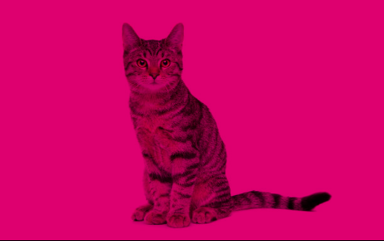
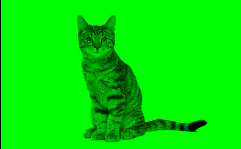

# Colorify

Program to color images with RGB decimal code. Made with SDL2/OpenGL.






# How to run the program
1. Install dependencies.

Debian
```
sudo apt install libsdl2-dev
sudo apt install libglew-dev
```
Arch Linux
```
sudo pacman -S sdl2
sudo pacman -S glew
```
2. Clone repository
```
git clone https://github.com/valtteriviirret/Colorify.git
```
3. Add your image to **pictures** directory

4. Go to programs directory and add commands
```
mkdir build && cd build
```

```
cmake ..
```

```
make
```

```
./Colorify
```

